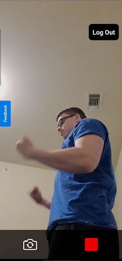

# Form-Check

Form-Check is an AI-powered application designed to analyze fitness form and provide feedback to users. This project uses computer vision techniques to detect errors in exercise repetitions, helping users improve their workout efficiency and safety.

---

## Features
- **Video Recording and Upload**: Record exercise videos directly within the app and upload them for analysis.
- **Form Analysis**: Detect errors in exercise form for each repetition using computer vision.
- **Feedback Summary**: Receive a detailed summary of detected issues to help improve your workout technique.
- **Firebase Integration**: Securely store and retrieve user-uploaded videos.
- **Responsive UI**: User-friendly interface for seamless video recording and analysis.

---

## Technologies Used
- **Frontend**: React Native, Expo Camera
- **Backend**: Python (FastAPI)
- **Database and Storage**: Firebase Authentication and Firebase Storage
- **Computer Vision**: OpenCV for form detection and error analysis
- **Communication**: Axios for client-server communication

---

## Screenshots
### Login Screen

### Analysis Summary

---

## Future Enhancements
- Add real-time form analysis during workouts.
- Expand support to more exercise types (working on Squats as of January 2025)
- Integrate user performance tracking and history.
